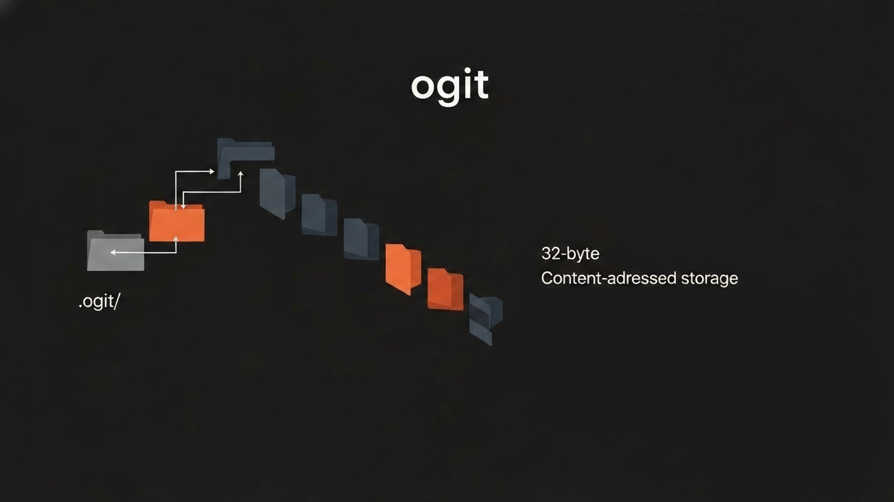

# ogit — Minimal Git-like Object Store (Rust)

`ogit` è un mini progetto CLI scritto in Rust che implementa un object store
content-addressed ispirato a Git.

Lo scopo principale del progetto è **didattico**: esplorare in modo pratico
ownership, borrowing e lifetimes attraverso un dominio reale (filesystem + hashing),
evitando strutture artificiali.

## Stato del progetto

Questo repository è sviluppato incrementalmente.

**STEP 1 completato:**

- inizializzazione repository (`ogit init`)
- helper di hashing deterministico su byte slice (`hash_bytes`)

## Requisiti

- Rust stable
- Nessuna dipendenza obbligatoria oltre `std`
- CLI implementata manualmente (senza `clap` nelle prime fasi)

## Scelte di design (STEP 1)

- Le operazioni di filesystem sono incapsulate nel core (`ogit`), non nel `main`.
- I path sono rappresentati tramite `Path`, evitando stringhe raw.
- L'helper `hash_bytes`:
  - accetta `&[u8]` (borrow puro)
  - restituisce un valore posseduto rappresentato da un array fisso di 32 elementi di tipo u8
  - non espone lifetime esplicite

Queste scelte sono intenzionali per evitare dangling references e coupling prematuro.

## Roadmap

- [x] STEP 1 — init repository + hashing
- [x] STEP 2 — blob object (read/write)
- [ ] STEP 3 — tree object
- [ ] STEP 4 — commit object
- [ ] STEP 5 — CLI polish
